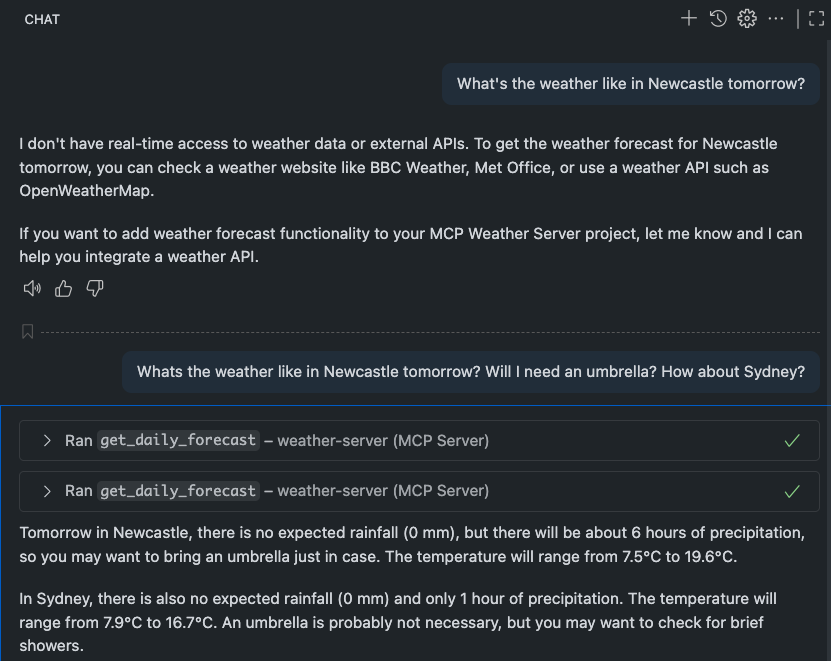

### How to Run the Server in VS Code

You can run the server automatically using the provided VS Code task:

1. Open the Command Palette (`Cmd+Shift+P` on macOS).
2. Type and select `Tasks: Run Build Task`.
3. Choose "Build and Run MCP Weather Server" from the list.

Alternatively, use the shortcut `Cmd+Shift+B` to run the default build task directly.

This will build your project and start the server automatically.
## MCP Server Weather

This project is an MCP (Model Context Protocol) server that provides weather forecasts for various locations. You can ask natural language questions about the weather, and the server will respond with relevant forecast information.

### Example Questions

- Will I need an umbrella tomorrow in Newcastle?
- What is the weather forecast for Sydney next week?
- Is it going to rain in Melbourne on Friday?
- What will the temperature be in Brisbane on Sunday?

The server understands natural language queries about weather and provides detailed forecasts.

Here's an example. For the first query the server was disabled.

